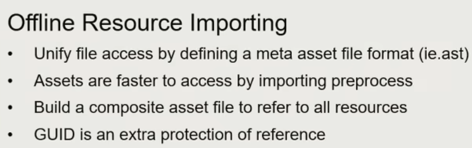
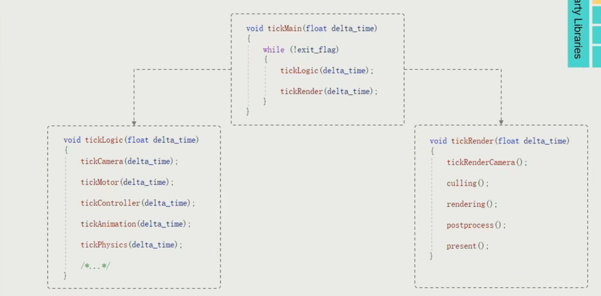
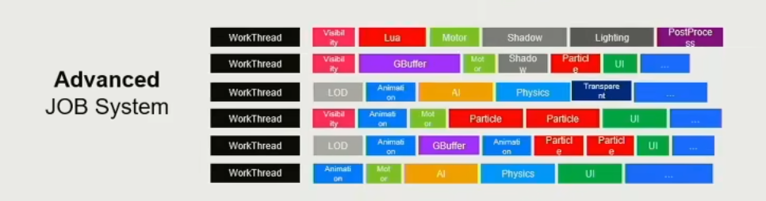
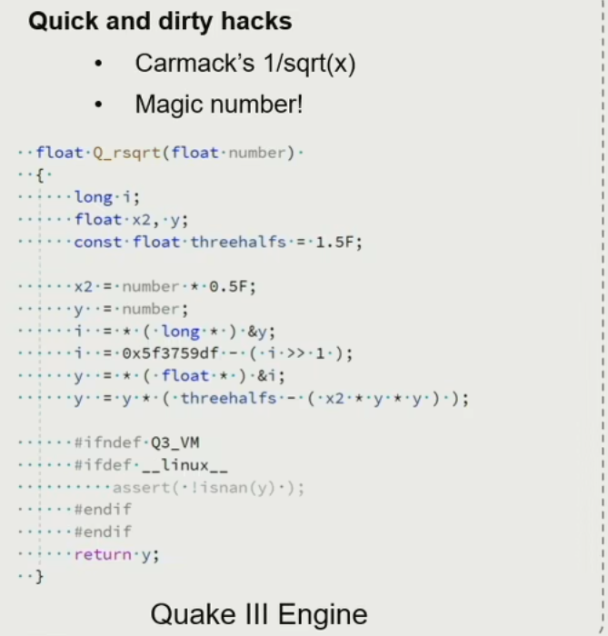
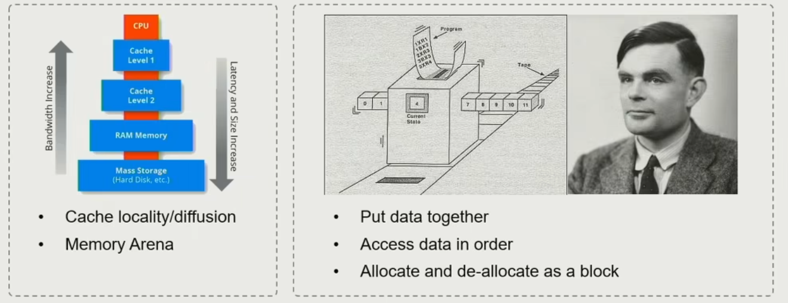
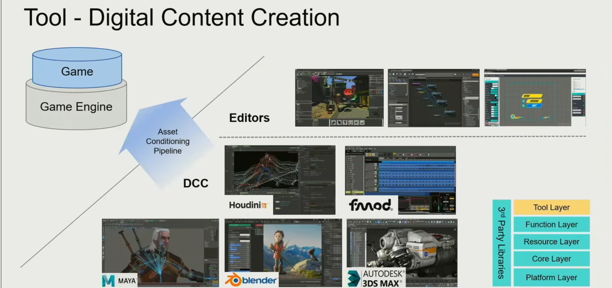

# 现代游戏引擎的五层

Tool Layer

Function Layer

Resource Layer

Core Layer

Platform Layer

## 资源层

Import：把Resource转换成Asset

GUID：资产唯一ID

## 功能层

### Dive into Ticks

tickLogic 逻辑帧 和 tickRender 渲染帧

### 多进程

## 核心层

数学库

### 数学效率

倒数平方根——卡马克

### 数据结构和容器

自己定制数据结构，避免碎片内存的产生

### 内存管理

* 把数据放到一起
* 让数据有序
* 一次性分配和抹除

### 核心层是游戏引擎的基础

## 平台层

多平台适配

Graphics API

不同硬件

## 工具层

所见即所得

脚本语言灵活：Cpp，Csharp，html5

数字资产

