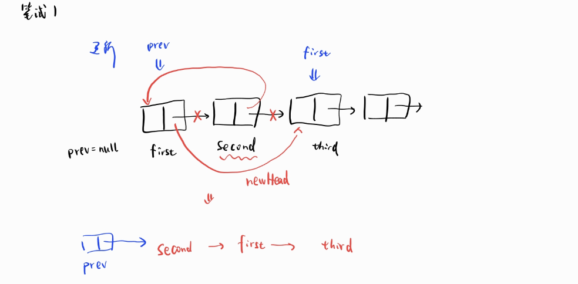
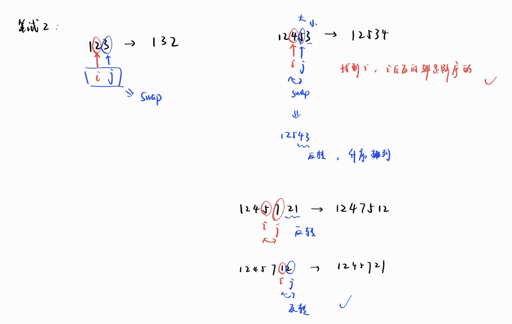
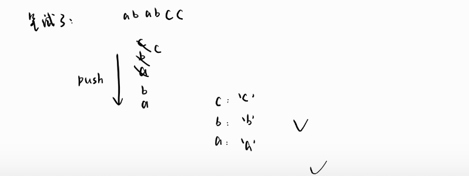

# 单链表的成对节点交换



> 这题是acm模式，main函数需要自己写

核心代码：

```csharp
    static ListNode SwapPairs(ListNode head)
    {
        if (head == null || head.next == null) return head;
      
        ListNode newHead = head.next;
        ListNode prev = null;//第一对节点的第一个节点的前驱
        ListNode first = head;

        while (first != null && first.next != null)
        {
            ListNode second = first.next;
            ListNode third = second.next;
            // 交换
            second.next = first; // 第二个节点指向第一个节点
            first.next = third;  // 第一个节点指向下一对的第一个节点
            // 如果当前的节点不是第一对节点的第一个节点
            if (prev != null)
            {
                prev.next = second;
            }
          
            prev = first;
            first = third;
        }
        return newHead;
    }
```

main

```csharp
    static void Main(string[] args)
    {
        // 读入链表
        string line = Console.ReadLine();
        string[] arr = line.Split(new char[] { ' '}, StringSplitOptions.RemoveEmptyEntries);
        ListNode head = null, tail = null;
        foreach (string s in arr)
        {
            if (s == "-1") break;
            ListNode node = new ListNode(int.Parse(s));
            if (head == null)
            {
                head = node;
                tail = node;
            }
            else
            {
                tail.next = node;
                tail = node;
            }
        }

        // 交换
        head = SwapPairs(head);

        // 输出
        while (head != null)
        {
            Console.Write(head.val);
            if (head.next != null) Console.Write(" ");
            head = head.next;
        }
        Console.WriteLine();
    }
```

# 下一个更大的数



```csharp
static int FindNextBigger(int N)
{
    char[] arr = N.ToString().ToCharArray();
    //从后往前找到第一个升序对的第一个数
    int i = arr.Length - 2;
    while (i >= 0 && arr[i] >= arr[i + 1]) i--;
    if (i < 0) return -1;

    int j = arr.Length - 1;
    //从后往前找到第一个比arr[i]大的数
    while (arr[j] <= arr[i]) j--;

    Swap(arr, i, j);
    //找到i，i之后的数就是降序排列的，所以需要反转
    Array.Reverse(arr, i + 1, arr.Length - i - 1);

    int next = int.Parse(new string(arr));
    return next;
}

static void Swap(char[] arr, int i, int j)
{
    char t = arr[i];
    arr[i] = arr[j];
    arr[j] = t;
}
```

# 合法字符串

abc和abc里面插入abc都是合法的



这是我一开始想的，但是时间复杂度n2，TLE了

```csharp
    static bool IsValid(string S)
    {
        while (S.Contains("abc"))
        {
            S = S.Replace("abc", "");
        }
        return S.Length == 0;
    }
```

换种思路，用出栈来消除每次匹配到的abc

```csharp
    static public bool IsValid(string S)
    {
        var stack = new Stack<char>();
        foreach (char ch in S)
        {
            stack.Push(ch);
            if (stack.Count >= 3)
            {
                char c = stack.Pop();
                char b = stack.Pop();
                char a = stack.Pop();
                if (a == 'a' && b == 'b' && c == 'c')
                {
                    // 匹配到"abc"，不需要再入栈
                    continue;
                }
                else
                {
                    // 不是"abc"，按原顺序重新入栈
                    stack.Push(a);
                    stack.Push(b);
                    stack.Push(c);
                }
            }
        }
        return stack.Count == 0;
    }

```

# 野猪骑士

找下一个地块：索引要更大而且高度更高

> 这题笔试的时候，把栈顶索引初始化写成了top = 0 。。。。

```csharp
#include <stdio.h>

#define MAXN 10000

int h[MAXN], nextHeight[MAXN], stack[MAXN];

int main() {
    int n, top = -1;
    //输入地块数量
    scanf("%d", &n);
    //输入每个地块的高度
    for(int i = 0; i < n; i++) scanf("%d", &h[i]);

    for(int i = n - 1; i >= 0; i--) {
        // 弹出所有不大于当前地块高度的栈元素，直到找到大于当前地块高度的栈元素
        while(top >= 0 && h[stack[top]] <= h[i]) top--;
        //找不到，就返回-1
        if(top == -1) nextHeight[i] = -1;
        //找到了，就返回该元素
        else nextHeight[i] = h[stack[top]];
        //当前地块的下标入栈
        top++;
        stack[top] = i;
    }
    //输出每个地块的下一个高度
    for(int i = 0; i < n; i++) printf("%d ", nextHeight[i]);
    printf("\n");
    return 0;
}
```
